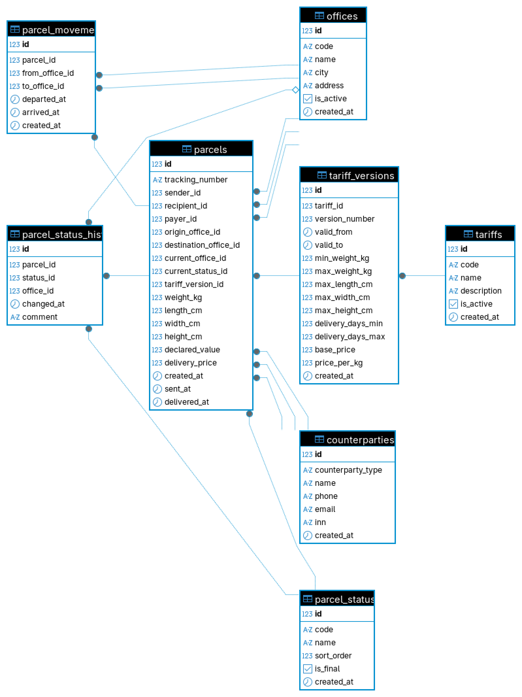

# Схема базы данных для сервиса доставки посылок

## О проекте

Этот репозиторий содержит схему базы данных PostgreSQL для сервиса доставки посылок. Проект выполнен в рамках тестового задания на стажировку по направлению DBA в CDEK. Схема хранит контрагентов, посылки, офисы, статусы посылок и тарифы. Также схема хранит текущий статус посылки, текущий офис, историю смены статусов и историю движения между офисами.

Главный файл проекта – `schema.sql`. Он содержит схему `delivery`, таблицы, связи, ограничения, индексы и комментарии к важным объектам.

В задании отдельно важен тариф. Посылка не ссылается только на актуальный тариф из справочника. Вместо этого таблица `parcels`, где лежат посылки, ссылается на конкретную строку таблицы `tariff_versions`, где лежат условия тарифа в нужный период. Так можно получить условия тарифа на момент оформления посылки. Если позже тариф изменится, старая посылка сохранит прежние условия.

## Стек

PostgreSQL 16, Docker Compose, DBeaver.

## Структура репозитория

Репозиторий содержит SQL-схему, Docker Compose для локального PostgreSQL и ER-диаграмму схемы. Основной результат лежит в `schema.sql`. Диаграмма лежит в папке `docs`. Файл `docker-compose.yml` поднимает локальный PostgreSQL, `schema.sql` создаёт схему базы данных для сервиса доставки, а `docs/schema-diagram.png` показывает таблицы и связи между ними.

```text
.
├── docker-compose.yml
├── docs
│   └── schema-diagram.png
├── README.md
└── schema.sql
```

## ER-диаграмма

Ниже показана ER-диаграмма схемы:



## Структура схемы

Проект создаёт отдельную схему PostgreSQL с именем `delivery`. Так таблицы проекта не смешиваются с объектами из стандартной схемы `public`.

В схеме есть такие таблицы:

* `counterparties` — физические лица и компании, которые участвуют в доставке;
* `offices` — офисы, где принимают, хранят, сортируют или выдают посылки;
* `parcel_statuses` — справочник возможных статусов посылки;
* `tariffs` — справочник услуг доставки;
* `tariff_versions` — условия тарифов в разные периоды;
* `parcels` — посылки и их текущие значения;
* `parcel_status_history` — история смены статусов посылки;
* `parcel_movements` — история движения посылки между офисами.

## Основные решения

### Контрагенты

Таблица `counterparties` хранит физических лиц и компании. Для этого в таблице есть поле `counterparty_type`.

Таблица `parcels`, где лежат посылки, ссылается на `counterparties` три раза:

1. Поле `sender_id` задаёт отправителя.
2. Поле `recipient_id` задаёт получателя.
3. Поле `payer_id` задаёт плательщика.

Так одна таблица хранит данные контрагентов, а сама посылка задаёт их роли. Это убирает дублирование данных контрагента.

### Офисы

Таблица `offices` хранит офисы доставки. Таблица `parcels` хранит офис отправки в поле `origin_office_id`, офис назначения в поле `destination_office_id` и текущий офис в поле `current_office_id`.

Текущий офис лежит прямо в таблице посылок, потому что сервис часто отвечает на вопрос, где посылка находится сейчас. Полный путь посылки лежит отдельно в таблице `parcel_movements`.

### Статусы

Таблица `parcel_statuses` хранит возможные статусы посылки. Таблица `parcels` хранит текущий статус в поле `current_status_id`.

История статусов лежит отдельно в таблице `parcel_status_history`. Я выбрал такой вариант, потому что сервис часто читает текущий статус. Если хранить только историю, базе пришлось бы каждый раз искать последнюю строку истории. Отдельное поле `current_status_id` в таблице `parcels` делает этот запрос проще и быстрее.

### Тарифы

Таблица `tariffs` хранит услугу доставки. Например, это может быть экспресс-доставка или эконом-доставка.

Таблица `tariff_versions` хранит условия тарифа:

* период действия;
* лимиты по весу;
* лимиты по габаритам;
* срок доставки;
* базовую цену;
* доплату за килограмм.

Таблица `parcels` хранит ссылку на конкретную версию тарифа в поле `tariff_version_id`. Это главное решение по тарифам. Оно фиксирует условия тарифа на момент оформления посылки. Если тариф изменится во время доставки, старая посылка останется связана со старой версией.

Таблица `parcels` также хранит итоговую цену доставки в поле `delivery_price`. Так старую цену не нужно пересчитывать по новым условиям тарифа.

### История движения

Таблица `parcel_movements` хранит движение посылки между офисами:

* поле `from_office_id` хранит офис, из которого отправили посылку;
* поле `to_office_id` хранит офис, куда отправили посылку;
* поле `departed_at` хранит время выхода из офиса;
* поле `arrived_at` хранит время прибытия в офис.

Поле `arrived_at` может быть пустым. Это нужно для случая, когда посылка уже вышла из одного офиса, но ещё не пришла в другой.

### Ограничения

В схеме есть ограничения, которые защищают данные от очевидных ошибок:

* трек-номер не может быть пустым;
* вес посылки должен быть больше нуля;
* габариты должны быть больше нуля;
* цена не может быть отрицательной;
* дата доставки не может быть раньше даты отправки;
* офис отправки и офис прибытия в одном перемещении не должны совпадать;
* версия тарифа не может иметь дату конца раньше даты начала.

Также внешние ключи связывают посылки с контрагентами, офисами, статусами и версиями тарифов.

### Индексы

Я заложил схему под OLTP-сценарий с частыми короткими запросами. Для этого в `schema.sql` есть индексы под основные сценарии:

* найти посылки по текущему статусу;
* найти посылки по текущему офису;
* найти посылки отправителя;
* найти посылки получателя;
* прочитать историю статусов одной посылки;
* прочитать маршрут одной посылки;
* найти версии тарифа по тарифу и дате.

Индекс на поле `tracking_number` отдельно не добавлен. Ограничение `unique` уже создаёт индекс в PostgreSQL.

## Как запустить проект

### 1. Подготовьте окружение

Установите Docker и Docker Compose.

Проверьте Docker. Выполните команду:

```bash
docker --version
```

Проверьте Docker Compose. Выполните команду:

```bash
docker compose version
```

Склонируйте репозиторий и перейдите в его корень. Выполните команду:

```bash
git clone https://github.com/tadzhnahal/cdek-dba-task
cd cdek-dba-task
```

### 2. Поднимите PostgreSQL

Запустите PostgreSQL через Docker Compose. Выполните команду:

```bash
docker compose up -d
```

После этого посмотрите список контейнеров. Выполните команду:

```bash
docker compose ps
```

В списке должен быть контейнер `delivery_postgres`.

### 3. Проверьте вход в базу

Откройте консоль PostgreSQL внутри контейнера. Выполните команду:

```bash
docker exec -it delivery_postgres psql -U delivery_app -d delivery
```

Проверьте имя базы и пользователя. Выполните запрос:

```sql
select current_database(), current_user;
```

Ожидаемый результат должен показать базу `delivery` и пользователя `delivery_app`.

Выйдите из консоли PostgreSQL. Выполните команду:

```sql
\q
```

### 4. Создайте схему базы данных

Выполните SQL-файл проекта. Выполните команду:

```bash
docker exec -i delivery_postgres psql -U delivery_app -d delivery < schema.sql
```

Файл можно запускать несколько раз. В начале он удаляет схему `delivery`, создаёт её заново и затем создаёт все таблицы, индексы и комментарии. При успешном запуске PostgreSQL выводит строки `CREATE TABLE`, `CREATE INDEX` и `COMMENT`.

### 5. Проверьте список схем

Откройте консоль PostgreSQL. Выполните команду:

```bash
docker exec -it delivery_postgres psql -U delivery_app -d delivery
```

Посмотрите список схем. Выполните команду:

```sql
\dn
```

В списке должна быть схема `delivery`.

### 6. Проверьте список таблиц

Посмотрите таблицы внутри схемы `delivery`. Выполните команду:

```sql
\dt delivery.*
```

В списке должны быть таблицы `counterparties`, `offices`, `parcel_statuses`, `tariffs`, `tariff_versions`, `parcels`, `parcel_status_history` и `parcel_movements`.

### 7. Проверьте таблицу посылок

Посмотрите структуру таблицы `parcels`, которая хранит посылки. Выполните команду:

```sql
\d+ delivery.parcels
```

В таблице должны быть поля для отправителя, получателя, плательщика, офисов, текущего статуса, версии тарифа, веса, габаритов и итоговой цены доставки. Также в таблице должны быть внешние ключи на таблицы `counterparties`, `offices`, `parcel_statuses` и `tariff_versions`.

### 8. Проверьте таблицу версий тарифов

Посмотрите структуру таблицы `tariff_versions`, которая хранит условия тарифов по периодам. Выполните команду:

```sql
\d+ delivery.tariff_versions
```

В таблице должны быть поля `tariff_id`, `version_number`, `valid_from`, `valid_to`, `min_weight_kg`, `max_weight_kg`, `max_length_cm`, `max_width_cm`, `max_height_cm`, `delivery_days_min`, `delivery_days_max`, `base_price` и `price_per_kg`.

### 9. Проверьте историю статусов

Посмотрите структуру таблицы `parcel_status_history`, которая хранит историю смены статусов. Выполните команду:

```sql
\d+ delivery.parcel_status_history
```

В таблице должны быть поля `parcel_id`, `status_id`, `office_id`, `changed_at` и `comment`.

### 10. Проверьте историю движения

Посмотрите структуру таблицы `parcel_movements`, которая хранит движение посылки между офисами. Выполните команду:

```sql
\d+ delivery.parcel_movements
```

В таблице должны быть поля `parcel_id`, `from_office_id`, `to_office_id`, `departed_at` и `arrived_at`.

### 11. Проверьте индексы

Посмотрите индексы схемы `delivery`. Выполните команду:

```sql
\di delivery.*
```

В списке должны быть индексы для таблиц `parcels`, `parcel_status_history`, `parcel_movements` и `tariff_versions`.

### 12. Выйдите из консоли PostgreSQL

Выполните команду:

```sql
\q
```

## Проверка через DBeaver

Схему можно открыть в DBeaver. Создайте новое подключение к PostgreSQL и укажите такие параметры:

```text
host: localhost
port: 5432
database: delivery
username: delivery_app
password: delivery_app_password
```

После входа в базу раскройте базу `delivery`, раздел `schemas`, схему `delivery` и папку `tables`. Там должны быть все таблицы из `schema.sql`.

## Как остановить проект

Когда закончите работу, остановите PostgreSQL. Выполните команду:

```bash
docker compose down
```

Если нужно удалить данные PostgreSQL вместе с volume, выполните команду:

```bash
docker compose down -v
```
